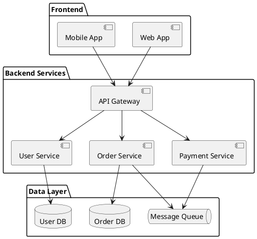
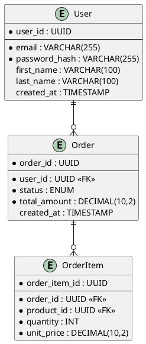
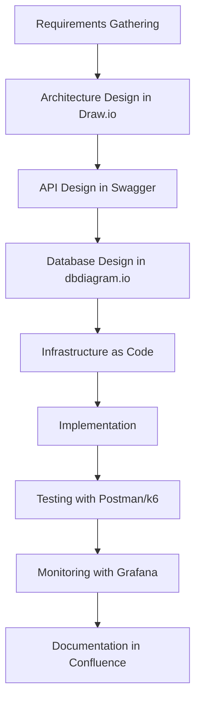

# System Design Tools and Resources 🛠️

## 🎯 Overview

This comprehensive guide covers essential tools for system design, from architecture diagramming to performance monitoring. Whether you're designing systems for interviews or real-world applications, these tools will help you communicate ideas effectively and build robust systems.

## 🎨 Diagramming and Visualization Tools

### 1. Draw.io (app.diagrams.net)
**Best for:** Free, web-based diagramming

**Features:**
- ✅ Free and open-source
- ✅ No registration required
- ✅ Real-time collaboration
- ✅ Extensive template library
- ✅ Integration with Google Drive, GitHub
- ✅ Export to multiple formats (PNG, SVG, PDF)

**System Design Use Cases:**
- Architecture diagrams
- Database schemas
- Network topologies
- Flowcharts
- Sequence diagrams

**Example Templates:**
```
AWS Architecture Templates:
- 3-tier web application
- Microservices on EKS
- Serverless architecture
- Data lake architecture

Azure Templates:
- Hub-spoke network
- App Service architecture
- Function apps workflow

Google Cloud Templates:
- GKE cluster design
- BigQuery data pipeline
- Cloud Function architecture
```

**Pro Tips:**
- Use layers to organize complex diagrams
- Create custom shape libraries for consistent designs
- Use connection points for clean line routing
- Export as SVG for scalable documentation

### 2. Lucidchart
**Best for:** Professional diagramming with advanced features

**Features:**
- ✅ Professional templates
- ✅ Real-time collaboration
- ✅ Data linking capabilities
- ✅ Presentation mode
- ✅ Integration with Confluence, Jira
- ❌ Paid tool (free tier limited)

**Advanced Features:**
- Dynamic data visualization
- Conditional formatting
- Process automation diagrams
- Org chart generation from data

### 3. Miro/Mural
**Best for:** Collaborative whiteboarding and brainstorming

**Features:**
- ✅ Infinite canvas
- ✅ Real-time collaboration
- ✅ Templates for design thinking
- ✅ Integration with design tools
- ✅ Video/audio communication

**System Design Use Cases:**
- Architecture brainstorming sessions
- Requirements gathering workshops
- Design thinking for user flows
- Team retrospectives

### 4. PlantUML
**Best for:** Code-based diagram generation

**Features:**
- ✅ Text-based diagram specification
- ✅ Version control friendly
- ✅ Multiple diagram types
- ✅ Integration with IDEs
- ✅ Automated generation

**Example System Architecture:**


**Database Schema Example:**


### 5. Excalidraw
**Best for:** Hand-drawn style diagrams

**Features:**
- ✅ Open-source and free
- ✅ Hand-drawn aesthetic
- ✅ Real-time collaboration
- ✅ No registration required
- ✅ Library of components

**Perfect for:**
- Quick sketches during interviews
- Informal architecture discussions
- Whiteboard-style presentations

## 🏗️ Architecture Design Tools

### 1. Cloudcraft
**Best for:** AWS architecture diagrams

**Features:**
- ✅ AWS-specific components
- ✅ Cost estimation integration
- ✅ 3D visualization
- ✅ Live AWS account sync
- ✅ Security analysis

**Sample Architecture Types:**
- Three-tier web applications
- Serverless architectures
- Data processing pipelines
- Disaster recovery setups

### 2. AWS Architecture Center
**Best for:** AWS reference architectures

**Resources:**
- Well-Architected Framework
- Reference architecture diagrams
- Best practices guides
- Security patterns
- Cost optimization strategies

### 3. Microsoft Visio
**Best for:** Enterprise architecture documentation

**Features:**
- ✅ Professional diagramming
- ✅ Data connectivity
- ✅ Process documentation
- ✅ Org chart creation
- ❌ Windows-only, expensive

### 4. Gliffy
**Best for:** Simple, clean diagrams

**Features:**
- ✅ Easy to use interface
- ✅ Confluence integration
- ✅ Template library
- ✅ Collaborative editing

## 📊 Capacity Planning Tools

### 1. System Design Calculator
**Custom tool for quick estimations:**

```python
class SystemDesignCalculator:
    def __init__(self):
        self.units = {
            'storage': {
                'KB': 1024,
                'MB': 1024**2,
                'GB': 1024**3,
                'TB': 1024**4,
                'PB': 1024**5
            },
            'time': {
                'second': 1,
                'minute': 60,
                'hour': 3600,
                'day': 86400,
                'month': 2592000,
                'year': 31536000
            }
        }

    def calculate_storage(self, records, record_size, time_period='year'):
        """Calculate storage requirements"""
        total_records = records * self.units['time'][time_period]
        total_bytes = total_records * record_size

        return {
            'bytes': total_bytes,
            'GB': total_bytes / self.units['storage']['GB'],
            'TB': total_bytes / self.units['storage']['TB']
        }

    def calculate_bandwidth(self, requests_per_second, avg_response_size):
        """Calculate bandwidth requirements"""
        bytes_per_second = requests_per_second * avg_response_size

        return {
            'bytes_per_second': bytes_per_second,
            'mbps': (bytes_per_second * 8) / (1024 * 1024),
            'gbps': (bytes_per_second * 8) / (1024 * 1024 * 1024)
        }

    def calculate_servers(self, total_rps, server_capacity_rps, redundancy_factor=2):
        """Calculate server requirements"""
        base_servers = total_rps / server_capacity_rps
        total_servers = base_servers * redundancy_factor

        return {
            'base_servers': int(base_servers),
            'with_redundancy': int(total_servers),
            'redundancy_factor': redundancy_factor
        }

# Usage example
calc = SystemDesignCalculator()

# Calculate storage for 1M daily active users, each generating 50 records/day
storage = calc.calculate_storage(
    records=1000000 * 50,  # 50M records per day
    record_size=1024,      # 1KB per record
    time_period='year'
)
print(f"Annual storage: {storage['TB']:.2f} TB")

# Calculate bandwidth for 10K RPS with 5KB average response
bandwidth = calc.calculate_bandwidth(10000, 5120)
print(f"Bandwidth needed: {bandwidth['mbps']:.2f} Mbps")

# Calculate servers for 100K RPS, each server handles 1K RPS
servers = calc.calculate_servers(100000, 1000)
print(f"Servers needed: {servers['with_redundancy']} (including redundancy)")
```

### 2. Online Calculators

**RPS Calculator:**
```javascript
// Simple RPS calculator for web use
function calculateRPS(dailyActiveUsers, requestsPerUserPerDay) {
    const totalDailyRequests = dailyActiveUsers * requestsPerUserPerDay;
    const averageRPS = totalDailyRequests / (24 * 60 * 60);
    const peakRPS = averageRPS * 3; // Assume 3x peak multiplier

    return {
        averageRPS: Math.round(averageRPS),
        peakRPS: Math.round(peakRPS),
        totalDailyRequests: totalDailyRequests
    };
}

// Storage calculator
function calculateStorage(itemsPerDay, avgItemSize, retentionDays) {
    const totalItems = itemsPerDay * retentionDays;
    const totalBytes = totalItems * avgItemSize;

    return {
        totalItems: totalItems,
        storageGB: Math.round(totalBytes / (1024 * 1024 * 1024)),
        storageTB: Math.round(totalBytes / (1024 * 1024 * 1024 * 1024) * 100) / 100
    };
}
```

### 3. Spreadsheet Templates

**System Sizing Template:**
```
Component Estimation Spreadsheet:

Traffic Estimation:
- Daily Active Users: 10,000,000
- Requests per User per Day: 50
- Peak Hour Multiplier: 3x
- Read/Write Ratio: 10:1

Calculated Values:
- Total Daily Requests: 500,000,000
- Average RPS: 5,787
- Peak RPS: 17,361
- Write RPS: 1,736
- Read RPS: 15,625

Storage Estimation:
- Data per Request: 1KB
- Daily Data Generated: 500GB
- Retention Period: 365 days
- Total Storage Needed: 182.5TB
- With Replication (3x): 547.5TB

Server Estimation:
- RPS per Server: 1,000
- Servers for Peak Load: 18
- With Redundancy (2x): 36
- Database Servers: 6 (read replicas)
```

## 🔧 Development and Testing Tools

### 1. API Design Tools

**Swagger/OpenAPI:**
```yaml
# API specification example
openapi: 3.0.0
info:
  title: E-commerce API
  version: 1.0.0
  description: REST API for e-commerce platform

paths:
  /api/v1/products:
    get:
      summary: List products
      parameters:
        - name: page
          in: query
          schema:
            type: integer
            default: 1
        - name: limit
          in: query
          schema:
            type: integer
            default: 20
      responses:
        '200':
          description: List of products
          content:
            application/json:
              schema:
                type: object
                properties:
                  products:
                    type: array
                    items:
                      $ref: '#/components/schemas/Product'
                  pagination:
                    $ref: '#/components/schemas/Pagination'

components:
  schemas:
    Product:
      type: object
      properties:
        id:
          type: string
          format: uuid
        name:
          type: string
        price:
          type: number
          format: decimal
        description:
          type: string
```

**Postman Collections:**
- API testing and documentation
- Environment management
- Automated testing
- Mock servers
- Team collaboration

### 2. Load Testing Tools

**Apache JMeter Configuration:**
```xml
<?xml version="1.0" encoding="UTF-8"?>
<jmeterTestPlan version="1.2">
  <hashTree>
    <TestPlan testname="E-commerce Load Test">
      <elementProp name="TestPlan.arguments" elementType="Arguments" guiclass="ArgumentsPanel">
        <collectionProp name="Arguments.arguments">
          <elementProp name="users" elementType="Argument">
            <stringProp name="Argument.name">users</stringProp>
            <stringProp name="Argument.value">1000</stringProp>
          </elementProp>
          <elementProp name="ramp" elementType="Argument">
            <stringProp name="Argument.name">ramp</stringProp>
            <stringProp name="Argument.value">300</stringProp>
          </elementProp>
        </collectionProp>
      </elementProp>
    </TestPlan>

    <hashTree>
      <ThreadGroup testname="User Behavior">
        <stringProp name="ThreadGroup.num_threads">${users}</stringProp>
        <stringProp name="ThreadGroup.ramp_time">${ramp}</stringProp>
        <stringProp name="ThreadGroup.duration">1800</stringProp>

        <hashTree>
          <HTTPSamplerProxy testname="Browse Products">
            <stringProp name="HTTPSampler.domain">api.ecommerce.com</stringProp>
            <stringProp name="HTTPSampler.path">/api/v1/products</stringProp>
            <stringProp name="HTTPSampler.method">GET</stringProp>
          </HTTPSamplerProxy>

          <HTTPSamplerProxy testname="Add to Cart">
            <stringProp name="HTTPSampler.domain">api.ecommerce.com</stringProp>
            <stringProp name="HTTPSampler.path">/api/v1/cart/items</stringProp>
            <stringProp name="HTTPSampler.method">POST</stringProp>
          </HTTPSamplerProxy>
        </hashTree>
      </ThreadGroup>
    </hashTree>
  </hashTree>
</jmeterTestPlan>
```

**k6 Load Testing Script:**
```javascript
import http from 'k6/http';
import { check, sleep } from 'k6';

export let options = {
    stages: [
        { duration: '5m', target: 100 },   // Ramp up
        { duration: '10m', target: 100 },  // Stay at 100 users
        { duration: '5m', target: 1000 },  // Ramp up to 1000
        { duration: '10m', target: 1000 }, // Stay at 1000
        { duration: '5m', target: 0 },     // Ramp down
    ],
    thresholds: {
        http_req_duration: ['p(95)<500'], // 95% of requests under 500ms
        http_req_failed: ['rate<0.01'],   // Error rate under 1%
    },
};

export default function() {
    // Browse products
    let response = http.get('https://api.ecommerce.com/api/v1/products');
    check(response, {
        'status is 200': (r) => r.status === 200,
        'response time < 500ms': (r) => r.timings.duration < 500,
    });

    sleep(1);

    // Add item to cart
    let payload = JSON.stringify({
        product_id: 'product_123',
        quantity: 1
    });

    response = http.post('https://api.ecommerce.com/api/v1/cart/items', payload, {
        headers: { 'Content-Type': 'application/json' },
    });

    check(response, {
        'cart add successful': (r) => r.status === 201,
    });

    sleep(2);
}
```

### 3. Database Design Tools

**DBDiagram.io:**
```sql
-- Database schema using DBML
Table users {
  user_id uuid [primary key]
  email varchar(255) [unique, not null]
  password_hash varchar(255) [not null]
  first_name varchar(100)
  last_name varchar(100)
  created_at timestamp [default: `now()`]
  updated_at timestamp [default: `now()`]

  Indexes {
    email [unique]
    (first_name, last_name)
  }
}

Table orders {
  order_id uuid [primary key]
  user_id uuid [ref: > users.user_id]
  status order_status [not null]
  total_amount decimal(10,2) [not null]
  created_at timestamp [default: `now()`]

  Indexes {
    user_id
    status
    created_at
  }
}

Table order_items {
  order_item_id uuid [primary key]
  order_id uuid [ref: > orders.order_id]
  product_id uuid [ref: > products.product_id]
  quantity integer [not null]
  unit_price decimal(10,2) [not null]
}

Enum order_status {
  pending
  confirmed
  shipped
  delivered
  cancelled
}
```

**MySQL Workbench:**
- Visual database design
- Forward/reverse engineering
- Query optimization
- Performance monitoring

## 📈 Monitoring and Analytics Tools

### 1. Application Performance Monitoring

**Grafana Dashboard Configuration:**
```json
{
  "dashboard": {
    "title": "System Performance Dashboard",
    "panels": [
      {
        "title": "Request Rate",
        "type": "graph",
        "targets": [
          {
            "expr": "rate(http_requests_total[5m])",
            "legendFormat": "{{method}} {{status_code}}"
          }
        ],
        "yAxes": [
          {
            "label": "Requests/sec"
          }
        ]
      },
      {
        "title": "Response Time",
        "type": "graph",
        "targets": [
          {
            "expr": "histogram_quantile(0.95, rate(http_request_duration_seconds_bucket[5m]))",
            "legendFormat": "95th percentile"
          },
          {
            "expr": "histogram_quantile(0.50, rate(http_request_duration_seconds_bucket[5m]))",
            "legendFormat": "50th percentile"
          }
        ]
      },
      {
        "title": "Error Rate",
        "type": "singlestat",
        "targets": [
          {
            "expr": "rate(http_requests_total{status=~\"5..\"}[5m]) / rate(http_requests_total[5m])",
            "format": "percent"
          }
        ]
      }
    ]
  }
}
```

**Prometheus Metrics Example:**
```python
from prometheus_client import Counter, Histogram, Gauge, start_http_server
import time

# Define metrics
REQUEST_COUNT = Counter('http_requests_total', 'Total HTTP requests', ['method', 'endpoint', 'status_code'])
REQUEST_LATENCY = Histogram('http_request_duration_seconds', 'HTTP request latency')
ACTIVE_CONNECTIONS = Gauge('active_connections', 'Number of active connections')
DATABASE_CONNECTIONS = Gauge('database_connections_active', 'Active database connections')

class MetricsMiddleware:
    def __init__(self):
        self.start_time = time.time()

    def process_request(self, request):
        request.start_time = time.time()
        ACTIVE_CONNECTIONS.inc()

    def process_response(self, request, response):
        duration = time.time() - request.start_time

        REQUEST_COUNT.labels(
            method=request.method,
            endpoint=request.path,
            status_code=response.status_code
        ).inc()

        REQUEST_LATENCY.observe(duration)
        ACTIVE_CONNECTIONS.dec()

        return response

# Start metrics server
start_http_server(8000)
```

### 2. Log Analysis Tools

**ELK Stack Configuration:**

**Logstash Configuration:**
```ruby
input {
  beats {
    port => 5044
  }
}

filter {
  if [fields][log_type] == "nginx" {
    grok {
      match => { "message" => "%{NGINXACCESS}" }
    }

    date {
      match => [ "timestamp", "dd/MMM/yyyy:HH:mm:ss Z" ]
    }

    mutate {
      convert => { "response" => "integer" }
      convert => { "bytes" => "integer" }
      convert => { "responsetime" => "float" }
    }
  }

  if [fields][log_type] == "application" {
    json {
      source => "message"
    }

    if [level] == "ERROR" {
      mutate {
        add_tag => [ "error" ]
      }
    }
  }
}

output {
  elasticsearch {
    hosts => ["elasticsearch:9200"]
    index => "logs-%{+YYYY.MM.dd}"
  }
}
```

**Kibana Dashboard Queries:**
```json
{
  "aggs": {
    "error_rate": {
      "filters": {
        "filters": {
          "errors": {
            "term": { "response": "5xx" }
          },
          "total": {
            "match_all": {}
          }
        }
      }
    },
    "response_times": {
      "histogram": {
        "field": "responsetime",
        "interval": 100
      }
    },
    "top_endpoints": {
      "terms": {
        "field": "request.keyword",
        "size": 10
      },
      "aggs": {
        "avg_response_time": {
          "avg": {
            "field": "responsetime"
          }
        }
      }
    }
  }
}
```

## 🔒 Security and Compliance Tools

### 1. Security Scanning

**OWASP ZAP Configuration:**
```python
#!/usr/bin/env python3
"""
Automated security scanning with OWASP ZAP
"""
from zapv2 import ZAPv2
import time

def security_scan(target_url):
    # Connect to ZAP proxy
    zap = ZAPv2(proxies={'http': 'http://127.0.0.1:8080',
                         'https': 'http://127.0.0.1:8080'})

    # Start spider scan
    print(f'Starting spider scan on {target_url}')
    scan_id = zap.spider.scan(target_url)

    # Wait for spider to complete
    while int(zap.spider.status(scan_id)) < 100:
        print(f'Spider progress: {zap.spider.status(scan_id)}%')
        time.sleep(5)

    # Start active scan
    print('Starting active scan')
    scan_id = zap.ascan.scan(target_url)

    # Wait for active scan to complete
    while int(zap.ascan.status(scan_id)) < 100:
        print(f'Active scan progress: {zap.ascan.status(scan_id)}%')
        time.sleep(10)

    # Generate report
    alerts = zap.core.alerts()

    print(f'Found {len(alerts)} security issues')

    # Categorize by risk level
    risk_counts = {'High': 0, 'Medium': 0, 'Low': 0, 'Informational': 0}
    for alert in alerts:
        risk_counts[alert['risk']] += 1

    print('Risk breakdown:')
    for risk, count in risk_counts.items():
        print(f'  {risk}: {count}')

    return alerts

if __name__ == '__main__':
    target = 'https://api.yourdomain.com'
    results = security_scan(target)
```

### 2. Compliance Monitoring

**SOC 2 Compliance Checklist:**
```yaml
# Infrastructure Security
infrastructure:
  - name: "Network Segmentation"
    status: "compliant"
    evidence: "VPC configuration with private subnets"
    last_reviewed: "2024-01-15"

  - name: "Encryption at Rest"
    status: "compliant"
    evidence: "All databases encrypted with AES-256"
    last_reviewed: "2024-01-15"

  - name: "Encryption in Transit"
    status: "compliant"
    evidence: "TLS 1.3 enforced on all endpoints"
    last_reviewed: "2024-01-15"

# Access Controls
access_controls:
  - name: "Multi-Factor Authentication"
    status: "compliant"
    evidence: "MFA required for all admin accounts"
    last_reviewed: "2024-01-15"

  - name: "Principle of Least Privilege"
    status: "in_progress"
    evidence: "Role-based access controls implemented"
    last_reviewed: "2024-01-15"

# Monitoring and Logging
monitoring:
  - name: "Security Event Logging"
    status: "compliant"
    evidence: "All authentication events logged"
    last_reviewed: "2024-01-15"

  - name: "Log Retention"
    status: "compliant"
    evidence: "Logs retained for 7 years"
    last_reviewed: "2024-01-15"
```

## 📚 Documentation Tools

### 1. Architecture Decision Records (ADRs)

**ADR Template:**
```markdown
# ADR-001: Database Technology Selection

## Status
Accepted

## Context
We need to choose a database technology for our e-commerce platform that can:
- Handle high read/write loads (100K+ QPS)
- Provide ACID guarantees for financial transactions
- Scale horizontally
- Integrate well with our microservices architecture

## Decision
We will use PostgreSQL as our primary database with read replicas for scaling reads.

## Consequences

### Positive
- Strong consistency guarantees
- Rich query capabilities
- Excellent tooling and community support
- Proven at scale

### Negative
- More complex to scale than NoSQL solutions
- Higher operational overhead
- May need sharding for extreme scale

### Neutral
- Team already familiar with PostgreSQL
- Industry standard for financial applications

## Implementation Plan
1. Set up master-slave replication
2. Implement connection pooling
3. Configure monitoring and alerting
4. Plan for horizontal scaling via sharding

## Alternatives Considered
- MongoDB: Rejected due to eventual consistency
- Cassandra: Rejected due to complexity and team expertise
- MySQL: Rejected due to PostgreSQL's superior feature set
```

### 2. API Documentation

**AsyncAPI for Event-Driven APIs:**
```yaml
asyncapi: 2.6.0
info:
  title: E-commerce Events API
  version: 1.0.0
  description: Event-driven API for e-commerce platform

channels:
  order/created:
    description: Channel for order creation events
    publish:
      message:
        name: OrderCreated
        payload:
          type: object
          properties:
            order_id:
              type: string
              format: uuid
            user_id:
              type: string
              format: uuid
            total_amount:
              type: number
              format: decimal
            items:
              type: array
              items:
                $ref: '#/components/schemas/OrderItem'
            created_at:
              type: string
              format: date-time

  payment/processed:
    description: Channel for payment processing events
    subscribe:
      message:
        name: PaymentProcessed
        payload:
          type: object
          properties:
            payment_id:
              type: string
              format: uuid
            order_id:
              type: string
              format: uuid
            amount:
              type: number
              format: decimal
            status:
              type: string
              enum: [success, failed, pending]

components:
  schemas:
    OrderItem:
      type: object
      properties:
        product_id:
          type: string
          format: uuid
        quantity:
          type: integer
          minimum: 1
        unit_price:
          type: number
          format: decimal
```

## 🎓 Learning and Practice Platforms

### 1. Online Sandboxes

**Cloud Provider Sandboxes:**
- AWS Free Tier
- Google Cloud Free Tier
- Azure Free Account
- Digital Ocean Credits

**Container Platforms:**
- Docker Hub
- Kubernetes Playground
- Play with Docker
- Katacoda scenarios

### 2. System Design Simulators

**Custom Load Simulator:**
```python
import asyncio
import aiohttp
import time
import random
from dataclasses import dataclass
from typing import List

@dataclass
class TestResult:
    timestamp: float
    response_time: float
    status_code: int
    success: bool

class LoadTester:
    def __init__(self, base_url: str, concurrent_users: int = 100):
        self.base_url = base_url
        self.concurrent_users = concurrent_users
        self.results: List[TestResult] = []

    async def simulate_user_behavior(self, session: aiohttp.ClientSession, user_id: int):
        """Simulate realistic user behavior"""
        try:
            # Browse products
            start_time = time.time()
            async with session.get(f"{self.base_url}/api/products") as response:
                end_time = time.time()
                self.results.append(TestResult(
                    timestamp=start_time,
                    response_time=end_time - start_time,
                    status_code=response.status,
                    success=response.status == 200
                ))

            # Wait between actions
            await asyncio.sleep(random.uniform(1, 3))

            # Add to cart
            start_time = time.time()
            payload = {
                "product_id": f"product_{random.randint(1, 1000)}",
                "quantity": random.randint(1, 3)
            }
            async with session.post(f"{self.base_url}/api/cart/items", json=payload) as response:
                end_time = time.time()
                self.results.append(TestResult(
                    timestamp=start_time,
                    response_time=end_time - start_time,
                    status_code=response.status,
                    success=response.status in [200, 201]
                ))

            # Checkout (less frequent)
            if random.random() < 0.1:  # 10% checkout rate
                await asyncio.sleep(random.uniform(5, 10))
                start_time = time.time()
                async with session.post(f"{self.base_url}/api/orders") as response:
                    end_time = time.time()
                    self.results.append(TestResult(
                        timestamp=start_time,
                        response_time=end_time - start_time,
                        status_code=response.status,
                        success=response.status in [200, 201]
                    ))

        except Exception as e:
            print(f"Error in user {user_id}: {e}")

    async def run_load_test(self, duration_seconds: int = 300):
        """Run load test for specified duration"""
        connector = aiohttp.TCPConnector(limit=self.concurrent_users * 2)
        timeout = aiohttp.ClientTimeout(total=30)

        async with aiohttp.ClientSession(connector=connector, timeout=timeout) as session:
            start_time = time.time()

            while time.time() - start_time < duration_seconds:
                # Create batch of concurrent users
                tasks = [
                    self.simulate_user_behavior(session, i)
                    for i in range(self.concurrent_users)
                ]

                await asyncio.gather(*tasks, return_exceptions=True)
                await asyncio.sleep(1)  # Brief pause between batches

    def generate_report(self) -> dict:
        """Generate performance report"""
        if not self.results:
            return {"error": "No results available"}

        successful_requests = [r for r in self.results if r.success]
        failed_requests = [r for r in self.results if not r.success]

        response_times = [r.response_time for r in successful_requests]

        return {
            "total_requests": len(self.results),
            "successful_requests": len(successful_requests),
            "failed_requests": len(failed_requests),
            "success_rate": len(successful_requests) / len(self.results) * 100,
            "avg_response_time": sum(response_times) / len(response_times) if response_times else 0,
            "min_response_time": min(response_times) if response_times else 0,
            "max_response_time": max(response_times) if response_times else 0,
            "p95_response_time": sorted(response_times)[int(len(response_times) * 0.95)] if response_times else 0
        }

# Usage
async def main():
    tester = LoadTester("https://api.yourdomain.com", concurrent_users=50)
    await tester.run_load_test(duration_seconds=60)
    report = tester.generate_report()
    print(f"Load test results: {report}")

if __name__ == "__main__":
    asyncio.run(main())
```

## 🔗 Tool Integration Workflows

### 1. Design to Implementation Pipeline



### 2. Continuous Architecture Validation

```yaml
# GitHub Actions workflow for architecture validation
name: Architecture Validation

on:
  pull_request:
    paths:
      - 'docs/architecture/**'
      - 'infrastructure/**'

jobs:
  validate-architecture:
    runs-on: ubuntu-latest
    steps:
      - uses: actions/checkout@v3

      - name: Validate Architecture Decision Records
        run: |
          # Check ADR format and numbering
          python scripts/validate_adrs.py

      - name: Generate Architecture Diagrams
        run: |
          # Auto-generate diagrams from code
          plantuml docs/architecture/*.puml

      - name: Validate Infrastructure
        run: |
          # Terraform plan and validate
          terraform plan -detailed-exitcode

      - name: Security Scan
        run: |
          # Run security scans on infrastructure
          checkov -d infrastructure/

      - name: Update Documentation
        run: |
          # Auto-update architecture documentation
          python scripts/update_docs.py
```

## 📋 Tool Selection Checklist

When choosing tools for your system design process, consider:

### Collaboration Requirements
- [ ] Real-time collaboration needed?
- [ ] Team size and distribution
- [ ] Integration with existing tools
- [ ] Version control requirements

### Technical Requirements
- [ ] Diagram types needed
- [ ] Export format requirements
- [ ] Integration capabilities
- [ ] Performance and scalability

### Budget Constraints
- [ ] Free vs. paid options
- [ ] Per-user pricing model
- [ ] Enterprise features needed
- [ ] Total cost of ownership

### Learning Curve
- [ ] Team expertise level
- [ ] Training requirements
- [ ] Documentation quality
- [ ] Community support

## 🎯 Recommended Tool Stack

### For Beginners
- **Diagramming:** Draw.io
- **API Design:** Swagger Editor
- **Database Design:** dbdiagram.io
- **Load Testing:** k6
- **Monitoring:** Grafana + Prometheus

### For Teams
- **Diagramming:** Lucidchart
- **Collaboration:** Miro
- **Documentation:** Confluence
- **API Management:** Postman Team
- **Monitoring:** DataDog or New Relic

### For Enterprise
- **Architecture:** Enterprise Architect
- **Diagramming:** Visio + Lucidchart
- **API Management:** Kong + Swagger
- **Monitoring:** Full observability stack
- **Security:** Comprehensive scanning tools

Remember: The best tool is the one your team will actually use consistently. Start simple and evolve your toolchain as your needs grow.